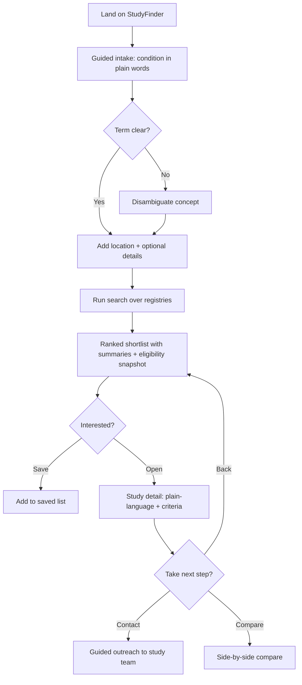
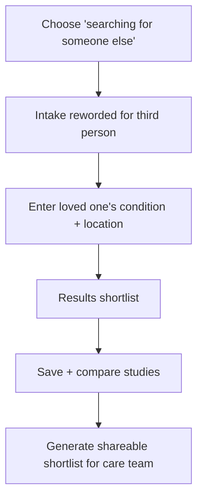
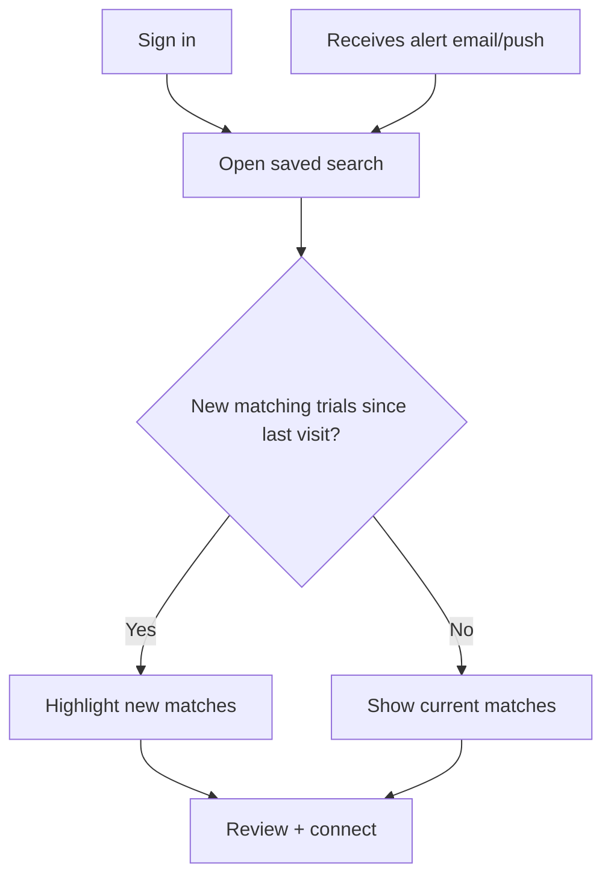
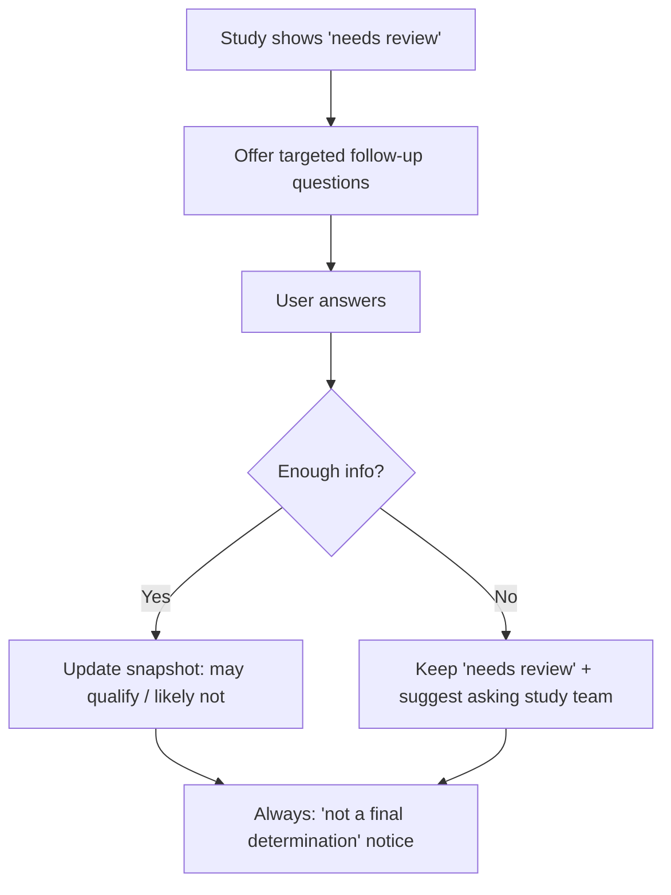

# 8. User Flows

[← Non-Functional Requirements](07-non-functional-requirements.md) · [Home](../README.md) · Next: [Data Model →](09-data-model.md)

Diagrams use [Mermaid](https://mermaid.js.org/), which renders natively on GitHub.

## Flow 1 — First-time discovery (happy path)

## Flow 2 — Caregiver searching for someone else

## Flow 3 — Returning user with saved search & alert

## Flow 4 — Eligibility snapshot refinement

## Edge cases & error states

- **No results:** offer to broaden condition, expand radius, or include not-yet-recruiting studies.
- **Source unavailable:** serve cached results with a staleness banner ([NFR-6](07-non-functional-requirements.md)).
- **Ambiguous condition:** always confirm the mapped concept before searching.
- **Guest saves then leaves:** offer account creation to persist the saved list.
- **Contact info missing on source:** fall back to source-record link + generic guidance.

---

[← Non-Functional Requirements](07-non-functional-requirements.md) · [Home](../README.md) · Next: [Data Model →](09-data-model.md)
