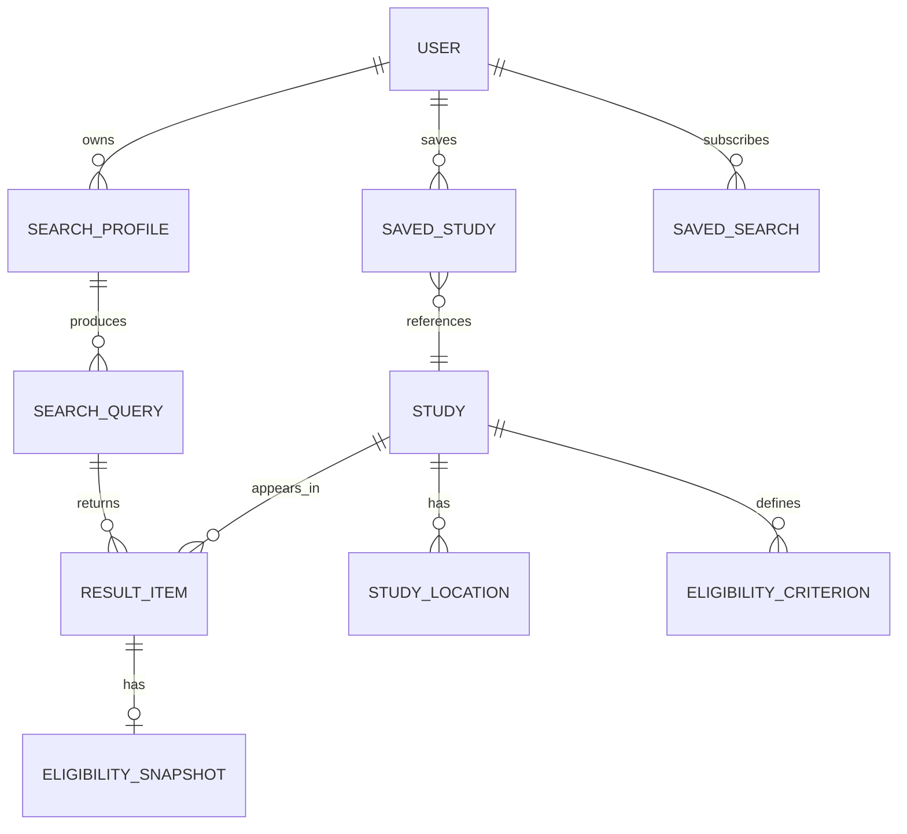

# 9. Data Model

[← User Flows](08-user-flows.md) · [Home](../README.md) · Next: [Integrations →](10-integrations.md)

Conceptual model only — not a database schema. Physical design lives with engineering.

## Entity-relationship overview

## Core entities

### User
Optional account. Guests operate without one.
| Field | Notes |
|-------|-------|
| id | Stable identifier |
| auth_ref | External auth provider reference |
| locale | Preferred language/locale |
| consent_state | Consent flags + timestamps (see [Compliance](11-compliance-privacy-security.md)) |
| created_at / deleted_at | Supports right-to-delete |

### SearchProfile
The health-related inputs used to match. **Sensitive** — minimized and consent-gated.
| Field | Notes |
|-------|-------|
| condition_concepts[] | Standardized concept IDs + original free text |
| on_behalf_of | self / someone_else |
| location | Geo (coarse by default) |
| age, sex | Optional |
| clinical_details[] | High-signal, filter-relevant attributes |

### Study
Normalized representation of a trial, synced from sources.
| Field | Notes |
|-------|-------|
| source, source_id | e.g., ClinicalTrials.gov / NCT number |
| title, plain_summary | Original + generated plain-language |
| status | recruiting / not-yet-recruiting / other |
| phase, intervention_type | |
| sponsor | |
| source_last_updated | For freshness/trust ([NFR-7](07-non-functional-requirements.md)) |

### StudyLocation
| Field | Notes |
|-------|-------|
| study_id | FK |
| facility, geo | |
| contact | Registered contact, if present |

### EligibilityCriterion
| Field | Notes |
|-------|-------|
| study_id | FK |
| type | inclusion / exclusion |
| raw_text, plain_text | Original + simplified |
| structured_hints | Parsed signals used for matching |

### EligibilitySnapshot
Per-user, per-study assessment. Derived, non-authoritative.
| Field | Notes |
|-------|-------|
| status | may_qualify / needs_review / likely_not |
| reasons[] | Plain-language contributing factors |
| generated_at, model_version | Auditability |

### SavedStudy / SavedSearch
User-owned collections; SavedSearch carries alert preferences.

## Data classification

| Data | Class | Handling |
|------|-------|----------|
| Study/registry data | Public | Cacheable |
| SearchProfile, EligibilitySnapshot | **Sensitive (health)** | Consent-gated, encrypted, deletable |
| Account/auth | PII | Standard PII controls |

See [Compliance, Privacy & Security](11-compliance-privacy-security.md) for retention and handling rules.

---

[← User Flows](08-user-flows.md) · [Home](../README.md) · Next: [Integrations →](10-integrations.md)
